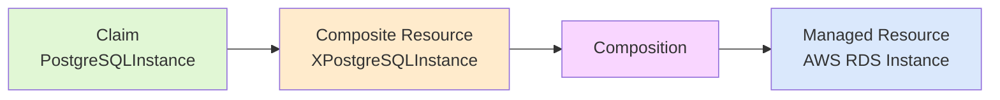

# DEP DEMO

This project uses MkDocs for documentation and idpbuilder for development environment setup. For full documentation visit [mkdocs.org](https://www.mkdocs.org).

## Documentation with MkDocs

### MkDocs Commands

* `mkdocs new [dir-name]` - Create a new project.
* `mkdocs serve` - Start the live-reloading docs server.
* `mkdocs build` - Build the documentation site.
* `mkdocs -h` - Print help message and exit.

### Mkdocs Layout

    mkdocs.yml    # The configuration file.
    docs/
        index.md  # The documentation homepage.
        ...       # Other markdown pages, images and other files.

## Development Environment

### Installing Go

This project requires Go. To install Go:

1. **Download Go**:
   Visit [go.dev/dl](https://go.dev/dl/) and download the latest version for your operating system, or use your package manager:

   ```bash
   # macOS with Homebrew
   brew install go

   # Linux with apt
   sudo apt-get update
   sudo apt-get install golang-go

   # Linux with yum
   sudo yum install golang
   ```

2. **Verify Installation**:
   ```bash
   go version
   ```

3. **Set up Go Environment** (if not already done):
   ```bash
   # Add these to your ~/.bashrc or ~/.zshrc
   export GOPATH=$HOME/go
   export PATH=$PATH:$GOPATH/bin
   ```

### Using Devbox

This project uses devbox for environment management. 
To get started:

1. **First Time Setup**:
   
   ```bash
   # Install devbox
   curl -fsSL https://get.jetpack.io/devbox | bash

   # Initialize devbox
   devbox init

   # Add nushell to devbox
   devbox add nu
   ```

2. **Regular Usage**:
  
   ```bash
   # Enter devbox environment
   devbox shell

   # Start nushell (optional)
   nu
   ```

### Using idpbuilder

This project uses idpbuilder to set up a complete internal developer platform. To get started:

1. **Install idpbuilder**:
   ```bash
   arch=$(if [[ "$(uname -m)" == "x86_64" ]]; then echo "amd64"; else uname -m; fi)
   os=$(uname -s | tr '[:upper:]' '[:lower:]')
   idpbuilder_latest_tag=$(curl --silent "https://api.github.com/repos/cnoe-io/idpbuilder/releases/latest" | grep '"tag_name":' | sed -E 's/.*"([^"]+)".*/\1/')
   curl -LO  https://github.com/cnoe-io/idpbuilder/releases/download/$idpbuilder_latest_tag/idpbuilder-$os-$arch.tar.gz
   tar xvzf idpbuilder-$os-$arch.tar.gz
   ```

2. **Note about kubectl**:
   idpbuilder requires kubectl but will automatically manage its installation:
   - If the required version of kubectl is missing, idpbuilder will download it
   - The download is architecture-specific (e.g., darwin/arm64 for Apple Silicon)
   - You don't need to manually install kubectl

3. **Create Development Environment**:
   ```bash
   ./idpbuilder create
   ```

## Running the Application

### Local Development
1. **Run the Go Application**:
   
    ```bash
    go run main.go
    ```
    The server will start at `http://localhost:8080`

2. **Build the Binary**:
    ```bash
    go build -o hello-world main.go
    ```

### Docker and Kind Cluster Deployment

1. **Build Docker Image**:
  
    ```bash
    docker build -t hello-world:latest .
    ```
2. **Run Docker Container locally**:
   
    ```bash
    docker run -p 8080:8080 hello-world:latest
    ```

### Kubernetes Deployment

1. **Create and Load into Kind Cluster**:
   
    ```bash
    # Create kind cluster
    kind create cluster

    # Load the image into kind
    kind load docker-image my-hello-world:latest
    ```

2. **Deploy to Kind Cluster**:
  
   ```bash
    # Apply the deployment and service
    kubectl apply -f deployent.yml

    # Verify deployment
    kubectl get pods
    kubectl get services
    ```

### Debugging in Kind

1. **Add Ephemeral Debug Container**:
    
    ```bash
    # Get the pod name
    kubectl get pods

    # Attach ephemeral debug container
    kubectl debug -it <pod-name> --image=alpine --target=hello
    ```

2. **Inside Debug Container**:
    
    ```bash
    # Install debugging tools
    apk add curl wget netcat-openbsd

    # Test service connectivity
    nc -zv hello-service 80

    # Make HTTP requests to service
    wget -q0- http://hello-service

    # Check process information
    ps aux

    # View network configuration
    ip addr
    ```

3. **Debugging Tips**:
    - The ephemeral container shares the same network namespace as the target container
    - You can access the same filesystem as the scratch container
    - Debug container is temporary and will be removed when the session ends
    - No changes to the original deployment are required

4. **Exit and Cleanup**:
   
    ```bash
    # Exit the debug session
    exit

    # The ephemeral container is automatically cleaned up
    ```

## Additional Resources

### Documentation
- MkDocs documentation: [mkdocs.org](https://www.mkdocs.org)
- idpbuilder documentation: [cnoe.io/docs](https://cnoe.io/docs/reference-implementation/installations/idpbuilder)

### Community Support

If you have questions about idpbuilder, you can:
- Join the [CNCF Slack Channel](https://cloud-native.slack.com/archives/C05TN9WFN5S)
- Attend community meetings (see [calendar](https://calendar.google.com/calendar/embed?src=064a2adfce866ccb02e61663a09f99147f22f06374e7a8994066bdc81e066986%40group.calendar.google.com&ctz=America%2FLos_Angeles))

<!-- JUST BADGES & LINKS -->
[codespell-badge]: https://github.com/cnoe-io/idpbuilder/actions/workflows/codespell.yaml/badge.svg
[codespell-link]: https://github.com/cnoe-io/idpbuilder/actions/workflows/codespell.yaml

[e2e-badge]: https://github.com/cnoe-io/idpbuilder/actions/workflows/e2e.yaml/badge.svg
[e2e-link]: https://github.com/cnoe-io/idpbuilder/actions/workflows/e2e.yaml

[report-badge]: https://goreportcard.com/badge/github.com/cnoe-io/idpbuilder
[report-link]: https://goreportcard.com/report/github.com/cnoe-io/idpbuilder

[commit-activity-badge]: https://img.shields.io/github/commit-activity/m/cnoe-io/idpbuilder
[commit-activity-link]: https://github.com/cnoe-io/idpbuilder/pulse


