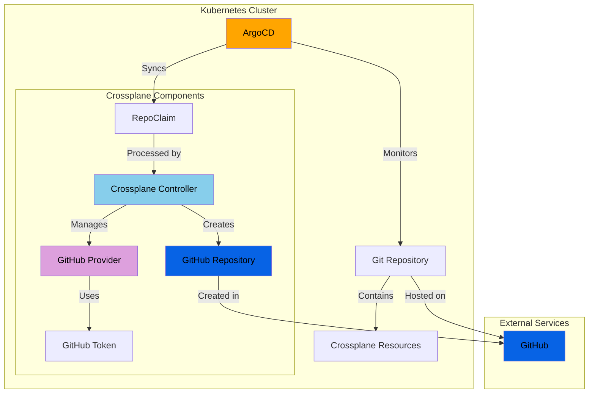

# GitOps Crossplane Demo

This demo shows how to use Crossplane to provision GitHub repositories through a GitOps workflow with ArgoCD. Instead of manually creating GitHub repositories, we'll define them as YAML and let Crossplane create them automatically through a GitOps process.

## Architecture Overview



## Prerequisites

- Git installed locally
- kubectl installed locally
- kind installed locally
- helm installed locally
- A GitHub account with permissions to create repositories

## Setup Steps

1. [Initial Cluster Setup](#initial-cluster-setup)
2. [Crossplane Installation](#crossplane-installation)
3. [Get Configuration Files](#get-configuration-files)
4. [ArgoCD Installation](#argocd-installation)
5. [GitHub Token Setup](#github-token-setup)
6. [Initial Provider Setup](#initial-provider-setup)
7. [ArgoCD Setup](#argocd-setup)
8. [Creating GitHub Repositories](#creating-github-repositories-through-gitops)

## Initial Cluster Setup

1. Create a new kind cluster:
```bash
kind create cluster --name gitops-demo
```

2. Verify the cluster is running:
```bash
kubectl cluster-info --context kind-gitops-demo
```

## Crossplane Installation

1. Install Crossplane using Helm:
```bash
# Add the Crossplane Helm repository
helm repo add crossplane-stable https://charts.crossplane.io/stable
helm repo update

# Create the crossplane-system namespace
kubectl create namespace crossplane-system

# Install Crossplane
helm install crossplane --namespace crossplane-system crossplane-stable/crossplane
```

2. Wait for Crossplane to be ready:
```bash
kubectl wait --for=condition=ready pod -l app=crossplane --namespace crossplane-system --timeout=60s
kubectl wait --for=condition=ready pod -l app=crossplane-rbac-manager --namespace crossplane-system --timeout=60s
```

## Get Configuration Files

1. Clone this demo repository to get the required YAML files:
```bash
git clone https://github.com/osru-leu/gitops-crossplane-demo.git
cd gitops-crossplane-demo
```

2. Verify you have all the required files:
```bash
ls -la crossplane-resources/
# Should see:
# - provider.yaml
# - provider-config.yaml
# - repo-definition.yaml
# - repo-composition.yaml
# - repo-claim.yaml

ls -la argocd/
# Should see:
# - application.yaml
```

These files define:
- Crossplane GitHub provider configuration
- Custom resource definition for GitHub repositories
- Composition for mapping repository claims to GitHub repositories
- Example repository claim
- ArgoCD application configuration

## ArgoCD Installation

1. Create the ArgoCD namespace:
```bash
kubectl create namespace argocd
```

2. Install ArgoCD using the official manifest:
```bash
kubectl apply -n argocd -f https://raw.githubusercontent.com/argoproj/argo-cd/stable/manifests/install.yaml
```

3. Wait for ArgoCD components to be ready:
```bash
kubectl wait --for=condition=available deployment -l "app.kubernetes.io/part-of=argocd" -n argocd --timeout=2m
```

## GitHub Token Setup

1. Create a Personal Access Token (PAT) in GitHub:
   - Go to GitHub.com → Settings → Developer settings → Personal access tokens → Tokens (classic)
   - Click "Generate new token" → "Generate new token (classic)"
   - Name it something like "crossplane-demo"
   - Repository access:
     - Select "All repositories" (not just "Public repositories")
   - Permissions required:
     - `repo` (Full control of repositories)
       - repo:status
       - repo_deployment
       - public_repo
       - repo:invite
   - Copy the token immediately after creation (you won't see it again!)

2. Create the secret in your cluster:
```bash
export GITHUB_TOKEN='your-github-pat-here'
kubectl create secret generic github-creds \
  -n crossplane-system \
  --from-literal=credentials="{\"token\":\"$GITHUB_TOKEN\"}"
```

3. Verify token permissions:
```bash
# Using GitHub CLI
gh auth status

# The token should show access to 'repo' scope
```

## Initial Provider Setup

These steps need to be performed manually before ArgoCD can manage the Crossplane resources:

1. Install the GitHub provider:
```bash
cd gitops-crossplane-demo  # if not already in the directory
kubectl apply -f crossplane-resources/provider.yaml
```

2. Wait for the provider to be healthy:
```bash
kubectl wait --for=condition=healthy provider.pkg.crossplane.io/provider-github --timeout=2m
```

3. Apply the provider configuration (which uses the GitHub token):
```bash
kubectl apply -f crossplane-resources/provider-config.yaml
```

Note: Only the provider setup files (`provider.yaml` and `provider-config.yaml`) need to be applied manually. Do NOT manually apply:
- `repo-definition.yaml`
- `repo-composition.yaml`
- `repo-claim.yaml`

These files will be automatically applied by ArgoCD once it's configured in the next step.

## ArgoCD Setup

1. First, ensure you can access the ArgoCD UI:
```bash
# Get the ArgoCD admin password
kubectl -n argocd get secret argocd-initial-admin-secret -o jsonpath="{.data.password}" | base64 -d

# Port forward the ArgoCD UI (if needed)
kubectl port-forward svc/argocd-server -n argocd 8080:443
```

2. Apply the ArgoCD Application configuration:
```bash
kubectl apply -f argocd/application.yaml
```

3. Verify the Application is created and properly configured:
```bash
# Check application status
kubectl get applications -n argocd crossplane-github-repos

# Get detailed sync status
kubectl describe applications -n argocd crossplane-github-repos
```

At this point, ArgoCD will automatically detect and apply:
- The Custom Resource Definition (`repo-definition.yaml`)
- The Composition (`repo-composition.yaml`)
- The Repository Claim (`repo-claim.yaml`)

You can verify this by watching the resources appear in your cluster:
```bash
# Watch for the CRD to be created
kubectl get crds | grep repoclaims

# Watch for the composition
kubectl get compositions

# Watch for the repository claim
kubectl get repoclaim
```

## Creating GitHub Repositories through GitOps

At this point, ArgoCD will automatically:
1. Monitor the `crossplane-resources` directory
2. Apply the Custom Resource Definition (`repo-definition.yaml`)
3. Apply the Composition (`repo-composition.yaml`)
4. Create GitHub repositories based on any `RepoClaim` resources

To create a new GitHub repository:
1. The `repo-claim.yaml` file defines the repository specifications:
```yaml
apiVersion: github.example.org/v1alpha1
kind: RepoClaim
metadata:
  name: demo-repo
spec:
  name: gitops-crossplane-demo
  description: "A demo repo created via GitOps with Crossplane"
  private: false
  autoInit: true
```

2. ArgoCD will automatically apply this claim
3. Crossplane will create the GitHub repository according to the specifications

## Monitoring and Verification

You can monitor the process through:

1. ArgoCD UI (port-forwarded to localhost:8080)
2. Command line:
```bash
# Check ArgoCD application status
kubectl get applications -n argocd

# Check Crossplane resources
kubectl get providers
kubectl get providerconfigs
kubectl get repoclaim

# Check if the repository was created
kubectl get repositories.repo.github.upbound.io
```

## Making Changes

To create additional repositories or modify existing ones:

1. Add or modify `RepoClaim` resources in the `crossplane-resources` directory
2. ArgoCD will automatically detect and apply the changes
3. Crossplane will create or update the GitHub repositories accordingly

## Troubleshooting

Common issues and their solutions:

1. ArgoCD application shows "app path does not exist":
   - Verify the repository URL in your ArgoCD application configuration
   - Ensure all YAML files are in the correct directory structure

2. Crossplane provider not becoming healthy:
   - Check provider logs: `kubectl logs -n crossplane-system -l pkg.crossplane.io/provider=provider-github`
   - Verify GitHub token secret is correctly formatted

3. Repository creation fails:
   - Check the RepoClaim status: `kubectl describe repoclaim demo-repo`
   - Verify GitHub token has sufficient permissions

## Security Note

The GitHub PAT is sensitive and should NEVER be committed to any repository. The secret is created directly in the cluster and referenced by the provider configuration. 