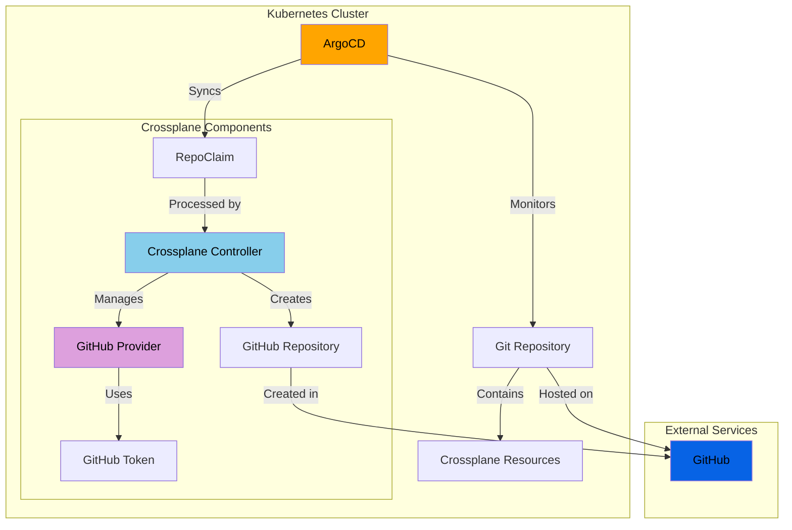

# GitOps Crossplane Demo

This demo shows how to use Crossplane to provision GitHub repositories through a GitOps workflow with ArgoCD.

## Architecture Overview



## Prerequisites

- A running Kubernetes cluster (kind)
- Crossplane installed
- ArgoCD installed
- GitHub account with permissions to create repositories

## GitHub Token Setup

1. Create a Personal Access Token (PAT) in GitHub:
   - Go to GitHub.com → Settings → Developer settings → Personal access tokens → Tokens (classic)
   - Click "Generate new token" → "Generate new token (classic)"
   - Name it something like "crossplane-demo"
   - Repository access:
     - Select "All repositories" (not just "Public repositories")
   - Permissions required:
     - `repo` (Full control of repositories)
       - repo:status
       - repo_deployment
       - public_repo
       - repo:invite
   - Copy the token immediately after creation (you won't see it again!)

2. Create the secret in your cluster:
```bash
export GITHUB_TOKEN='your-github-pat-here'
kubectl create secret generic github-creds \
  -n crossplane-system \
  --from-literal=credentials="{\"token\":\"$GITHUB_TOKEN\"}"
```

3. Verify token permissions:
```bash
# Using GitHub CLI
gh auth status

# The token should show access to 'repo' scope
```

## Configuration Files

- `crossplane-resources/`
  - `provider-config.yaml`: Configures the GitHub provider (references the secret)
  - `repo-definition.yaml`: Defines the RepoClaim custom resource
  - `repo-composition.yaml`: Maps RepoClaim fields to GitHub repository settings
  - `repo-claim.yaml`: Example repository claim
- `argocd/`
  - `application.yaml`: ArgoCD application configuration

## Health Checks

Verify the setup is working correctly:

```bash
# Check Crossplane and provider pods
kubectl get pods -n crossplane-system

# Verify GitHub provider status
kubectl get providers

# List all GitHub-related CRDs
kubectl get crds | grep github

# Check provider configuration
kubectl get providerconfigs

# Check ArgoCD installation and status
kubectl get pods -n argocd

# Verify ArgoCD applications
kubectl get applications -n argocd

# Get detailed status of our GitOps application
kubectl describe application crossplane-github-repos -n argocd
```

All pods should be in Running state, the provider should show as HEALTHY, and you should see various GitHub-related CRDs including `repositories.repo.github.upbound.io` and your custom `repoclaims.github.example.org`. ArgoCD pods should all be Running, and your application should show as Healthy and Synced.

## Verify Repository Creation

After applying your RepoClaim, verify the repository was created successfully:

```bash
# Check the claim status
kubectl get repoclaim
# Should show SYNCED: True and READY: True

# Check the XRepository (composite resource) status
kubectl get xrepos.github.example.org
# Should show SYNCED: True and READY: True

# Check if the actual GitHub repository resource is created
kubectl get repositories.repo.github.upbound.io
# Should show SYNCED: True and READY: True with your repository name
```

A successful creation will show all resources as SYNCED and READY, and the repository will be available in your GitHub account.

## Security Note

The GitHub PAT is sensitive and should NEVER be committed to any repository. The secret is created directly in the cluster and referenced by the provider configuration. 