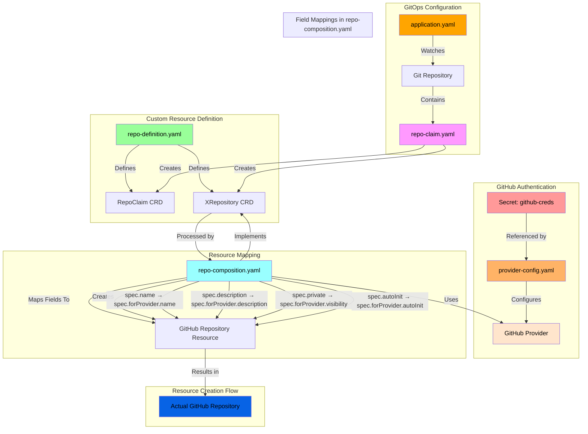

# Detailed Architecture and YAML Relationships

## YAML Configuration Flow

## YAML File Relationships

### Authentication Flow
- `github-creds` secret contains the GitHub PAT
- `provider-config.yaml` references this secret
- GitHub Provider uses this configuration for authentication

### Resource Definition Flow
- `repo-definition.yaml` (XRD) defines:
  - The RepoClaim custom resource
  - The XRepository composite resource
  - Available fields and their types

### Composition Flow
- `repo-composition.yaml`:
  - References the XRD
  - Maps RepoClaim fields to GitHub repository fields
  - Specifies transformations (e.g., boolean to string)
  - Sets default values

### GitOps Flow
- `application.yaml`:
  - Configures ArgoCD to watch the Git repository
  - Specifies which resources to sync
  - Defines sync behavior and frequency

### Claim Flow
- `repo-claim.yaml`:
  - Uses the custom resource definition
  - Specifies desired repository properties
  - Triggers the creation process 